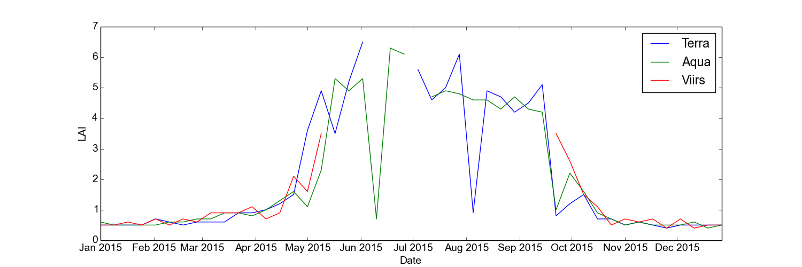

# modisViirsClient

Provides an interface to the ORNL Web Service REST API for MODIS and VIIRS-NPP data, and a basic class for handling small amounts of satellite data :artificial_satellite:

## Some examples:

### modisViirs_example_basic.py

Interrogate the server to explore the types of data available.

### modisViirs_example_lai_timeseries.py

Download and plot leaf area index (LAI) data for a site from both MODIS instruments and VIIRS.

## Relevant pages at ORNL:

https://modis.ornl.gov/data/modis_webservice.html

https://modis.ornl.gov/rst/ui/

## Information about MODIS data:

To find out things like band names in various products go here:

https://lpdaac.usgs.gov/dataset_discovery/modis/modis_products_table

n.b. this page details a *lot* more products than are available
on the ORNL server. To find out what is available via the ORNL
Web Service take a look in modisViirs_example_basic.py
